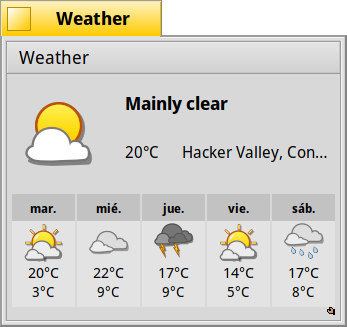

Weather
------------

Weather is a Haiku application that displays the constantly-updated weather of a specified location (*Edit --> Change location*). It shows the current condition there and a forecast of the next 5 days.
The temperature can be displayed in degrees Celsius, Fahrenheit, Kelvin, Rankine, or Delisle (*Edit --> Preferences*).

Weather displays daily highs/lows and cloudiness, precipitation, and sunlight. As a replicant, Weather can be easily integrated into the Desktop.

You can drag & drop colors, e.g. from Icon-O-Matic, onto the Weather window or the replicant to change the text or background colors. The replicant shows a transparent background by default.

Weather started as tasks for Google Code-In 2014/15 and has been improved
substantially since then.
